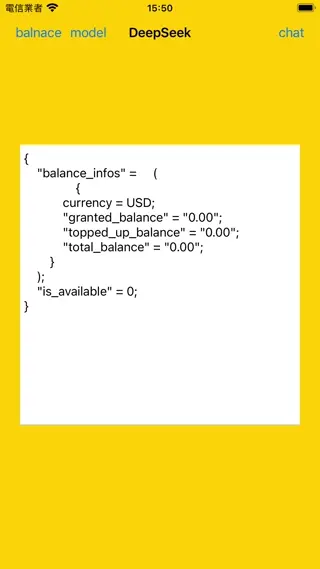

# WWSimpleDeepSeekAI
[](https://developer.apple.com/swift/) [](https://developer.apple.com/swift/)  [](https://developer.apple.com/swift/) [](https://developer.apple.com/swift/)

## [Introduction - 簡介](https://swiftpackageindex.com/William-Weng)
- [Simply use the functionality of DeepSeek AI.](https://www.deepseek.com/)
- [簡單的使用DeepSeek的AI功能。](https://medium.com/@kellenjohn175/how-to-guides-ollama-輕鬆打造低成本-llm-api-入門-deepseek-fastapi-1ac13d614f76)



### [Installation with Swift Package Manager](https://medium.com/彼得潘的-swift-ios-app-開發問題解答集/使用-spm-安裝第三方套件-xcode-11-新功能-2c4ffcf85b4b)
```js
dependencies: [
    .package(url: "https://github.com/William-Weng/WWSimpleDeepSeekAI.git", .upToNextMajor(from: "0.1.1"))
]
```

### [Function - 可用函式](https://api-docs.deepseek.com/)
|函式|功能|
|-|-|
|configure(apiKey:model)|[設定apiKey](https://platform.deepseek.com/api_keys)|
|list()|[支援模型列表](https://api-docs.deepseek.com/zh-cn/api/list-models)|
|balance()|[帳號餘額查詢](https://api-docs.deepseek.com/zh-cn/api/get-user-balance)|
|chat(content:forRole:)|[執行聊天功能](https://api-docs.deepseek.com/zh-cn/api/create-chat-completion)|

### Example - 範例
```swift
import UIKit
import WWSimpleDeepSeekAI

final class ViewController: UIViewController {

    private let apiKey = "<API_KEY>"
    
    @IBOutlet weak var myTextView: UITextView!
    
    override func viewDidLoad() {
        super.viewDidLoad()
        initSetting()
    }
    
    @IBAction func chatDemo(_ sender: UIBarButtonItem) {
        chat(with: "今天日期是？", role: .user)
    }
    
    @IBAction func modelListDemo(_ sender: UIBarButtonItem) {
        modelList()
    }
    
    @IBAction func balanceDemo(_ sender: UIBarButtonItem) {
        balance()
    }
}

// MARK: - 小工具
private extension ViewController {
    
    func initSetting() {
        WWSimpleDeepSeekAI.configure(apiKey: apiKey)
    }
    
    func modelList() {
        
        Task {
            let result = await WWSimpleDeepSeekAI.shared.list()
            
            switch result {
            case .failure(let error): displayText(error)
            case .success(let data): displayText(data?._jsonObject())
            }
        }
    }
    
    func balance() {
        
        Task {
            let result = await WWSimpleDeepSeekAI.shared.balance()
            
            switch result {
            case .failure(let error): displayText(error)
            case .success(let data): displayText(data?._jsonObject())
            }
        }
    }

    func chat(with content: String, role: WWSimpleDeepSeekAI.Role) {
        
        Task {
            let result = await WWSimpleDeepSeekAI.shared.chat(content: content, forRole: role)
            
            switch result {
            case .failure(let error): displayText(error)
            case .success(let data): displayText(data?._jsonObject())
            }
        }
    }
    
    @MainActor
    func displayText(_ value: Any?) {
        myTextView.text = "\(value ?? "")"
    }
}
```
